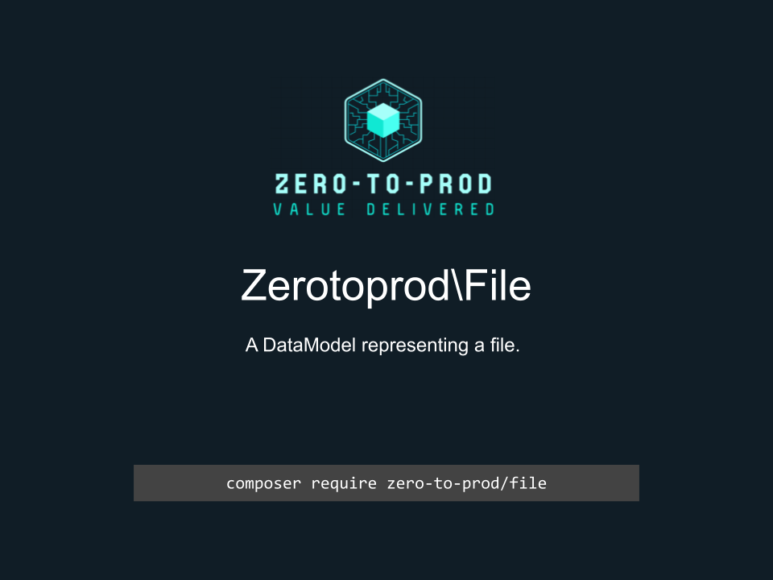

# Zerotoprod\File



[](https://github.com/zero-to-prod/file)
[](https://github.com/zero-to-prod/file/actions)
[](https://packagist.org/packages/zero-to-prod/file/stats)
[](https://packagist.org/packages/zero-to-prod/file/stats)
[](https://packagist.org/packages/zero-to-prod/file)
[](https://github.com/zero-to-prod/file/blob/main/LICENSE.md)
[](https://wakatime.com/badge/github/zero-to-prod/file)
[](https://hitsofcode.com/github/zero-to-prod/file/view?branch=main)

- [Introduction](#introduction)
- [Requirements](#requirements)
- [Installation](#installation)
- [Publishing DataModels](#publishing-datamodels)
- [Local Development](./LOCAL_DEVELOPMENT.md)
- [Contributing](#contributing)

## Introduction

A DataModel representing a file.

## Requirements

- PHP 8.1 or higher.

## Installation

Install `Zerotoprod\DynamicSetter` via [Composer](https://getcomposer.org/):

```bash
composer require zero-to-prod/file
```

This will add the package to your project’s dependencies and create an autoloader entry for it.

## Publishing DataModels

You can directly import these files into your project like this:

```shell
./vendor/bin/file app/File
```

The first argument is the destination of where the files are copied to.

## Contributing

Contributions, issues, and feature requests are welcome!
Feel free to check the [issues](https://github.com/zero-to-prod/file/issues) page if you want to contribute.

1. Fork the repository.
2. Create a new branch (`git checkout -b feature-branch`).
3. Commit changes (`git commit -m 'Add some feature'`).
4. Push to the branch (`git push origin feature-branch`).
5. Create a new Pull Request.